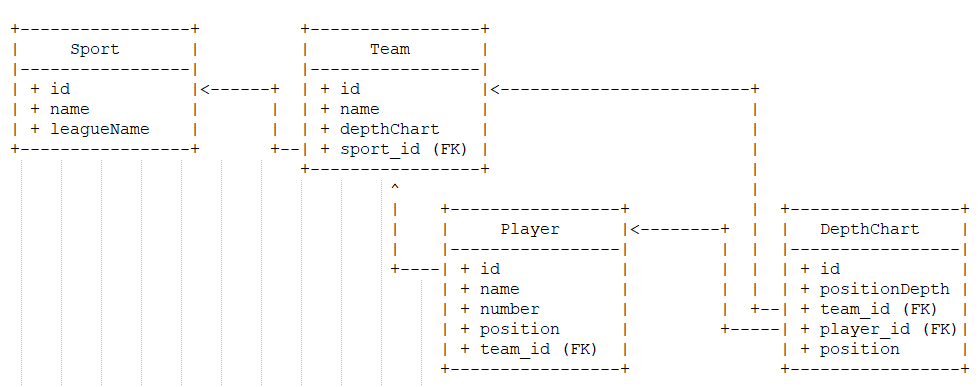
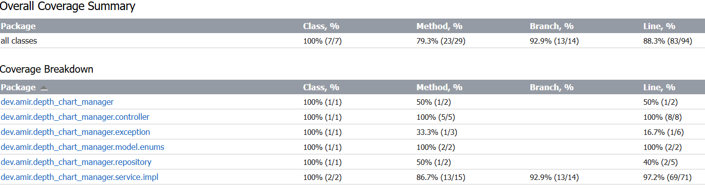

# depth-chart-manager
depth-chart-manager implements functionality that will allow us to work with teams' depth charts for further analysis.


## Overview
The Depth Chart Manager is a solution for managing and visualizing player depth charts. 
This application provides functionality to add, remove, and retrieve player positions, 
along with organizing players in a structured depth chart.

## Requirements
The <u>**service layer**</u> is complying with the business logic requirements expected which is to manage the depth chart without considering teams and sports as follows:
- addPlayerToDepthChart (position, player, position_depth)
  - Adds a player to the depth chart at a given position
  - Adding a player without a position_depth would add them to the end of the depth chart at that position
  - The added player would get priority. Anyone below that player in the depth chart would get moved down a position_depth
- removePlayerFromDepthChart(position, player)
  - Removes a player from the depth chart for a given position and returns that player
  - An empty list should be returned if that player is not listed in the depth chart at that position
- getBackups (position, player)
  - For a given player and position, we want to see all players that are “Backups”, those with a lower position_depth
  - An empty list should be returned if the given player has no Backups
  -  An empty list should be returned if the given player is not listed in the depth chart at that position
- getFullDepthChart()
  - Print out the full depth chart with every position on the team and every player within the Depth Chart

## Features Review
- Add players to a specific position in the depth chart and adjust the positions of remaining players.
- Remove players and adjust the positions of remaining players.
- Retrieve backups for a given player.
- View the full depth chart for all positions.

## Technologies Used
- **Java 21**: The core programming language used for development.
- **Spring Boot 3.3.5**: Framework for building the application.
- **JPA (Java Persistence API)**: For ORM (Object Relational Mapping).
- **Lombok**: To reduce boilerplate code. 
- **Mockito**: For unit testing.
- **PostgreSQL**: Database for storing data.
- **Docker**: For containerization of the application and database.

## Getting Started

### Prerequisites
- Java 21
- Maven
- Docker
- IDE of your choice (e.g., IntelliJ IDEA, Eclipse)

### Installation
1. Clone the repository:
   ```sh
   git clone https://github.com/farmad313/depth-chart-manager.git
   cd depth-chart-manager
    ```
2. Build the project:
    ```sh
   mvn clean install
    ```
3. Run docker-compose to start the Postgres database and depth-chart-manager application:
    ```sh
   docker-compose up --build
    ```
4. The application will be running on http://localhost:8081/depth-chart-manager-api/v1/

### API Endpoints
The <u>**controller layer **</u> are implemented supporting organization of players by position and depth **in various teams in various sports/leagues.**
You can use the following curl commands to test the API endpoints:

Create a new player and add to DepthChart in specific position depth:
   ```
curl --location --request POST 'http://localhost:8081/depth-chart-manager-api/v1/sport/nfl/team/buccaneers/depthchart/add?positionDepth=0' \
--header 'Content-Type: application/json' \
--data-raw '{
"number": 0,
"name": "Player0",
"position": "QB"
}'
   ```

Create a new player and add to DepthChart without specific position depth:
   ```
curl --location --request POST 'http://localhost:8081/depth-chart-manager-api/v1/sport/nfl/team/buccaneers/depthchart/add' \
--header 'Content-Type: application/json' \
--data-raw '{
"number": 1,
"name": "Player1",
"position": "QB"
}'
   ```

Get Backups for a given player:
   ```
curl --location --request GET 'http://localhost:8081/depth-chart-manager-api/v1/sport/nfl/team/buccaneers/depthchart/backups' \
--header 'Content-Type: application/json' \
--data-raw '{
"number": 0,
"name": "Player0",
"position": "QB"
}'
   ```


Remove a player from DepthChart:
   ```
curl --location --request DELETE 'http://localhost:8081/depth-chart-manager-api/v1/sport/nfl/team/buccaneers/depthchart/remove' \
--header 'Content-Type: application/json' \
--data-raw '{
"number": 0,
"name": "Player0",
"position": "QB"
}'
   ```

Get full DepthChart:
   ```
curl --location --request GET 'http://localhost:8081/depth-chart-manager-api/v1/sport/nfl/team/buccaneers/depthchart/full'
   ```

**NB!** The endpoint URL designed in a way to support sport and team in the future and just to show my solution to scale the application. 


### DataModel
The <u>**database layer**</u> are implemented supporting organization of players by position and depth **in various teams in various sports/leagues**
To support multiple sports, teams, and positions, the following data model has been implemented.



## Considerations
Dear reviewer, please note the following:
1. <span style="color:red"> I never left unused code in the project. Sport and Team in API urls and database entities which has not been used in service layer are just to show my solution to scale the application.</span>
2. <span style="color:red"> The defined composite unique constraint is not working due to null value in Team and Sport tables.</span>
3. <span style="color:red"> I always use DTOs to transfer data between layers. Here I used the same entity for the sake of simplicity and saving time to implement the solution. </span>

### Quality Assurance
- The application has been tested using JUnit and Mockito for unit testing.
- The application code quality was measured using SonarQube.
- The application test coverage was measured using JaCoCo:



### How it can easily support multiple sports and teams in future?
1. Insert sports/leagues into the sport table by init scripts or migration tools such as flyway, Liquibase.
2. Define controller for both sport and team to be able to add, remove teams to Team table.
3. Refactor DepthChartController to use already defined path variables of sport and team in API endpoints.
4. Refactor DepthChartService to pass team into its method and use it with player number as a composite key to find the players in the depth chart.

---

Developed by [Amirhossein Farmad](https://www.linkedin.com/in/amirhossein-farmad/)